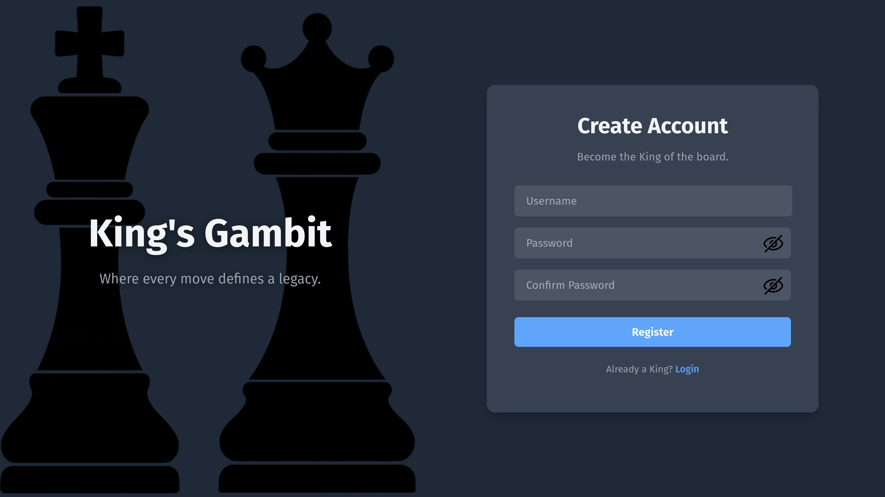
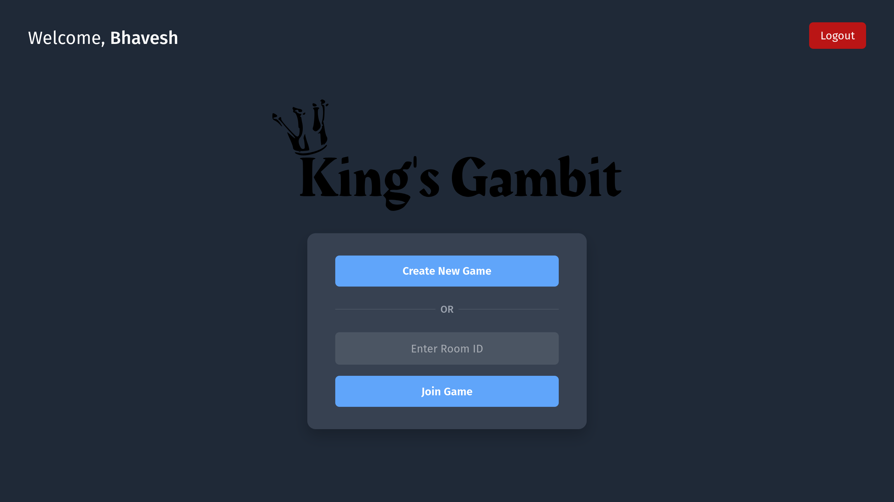
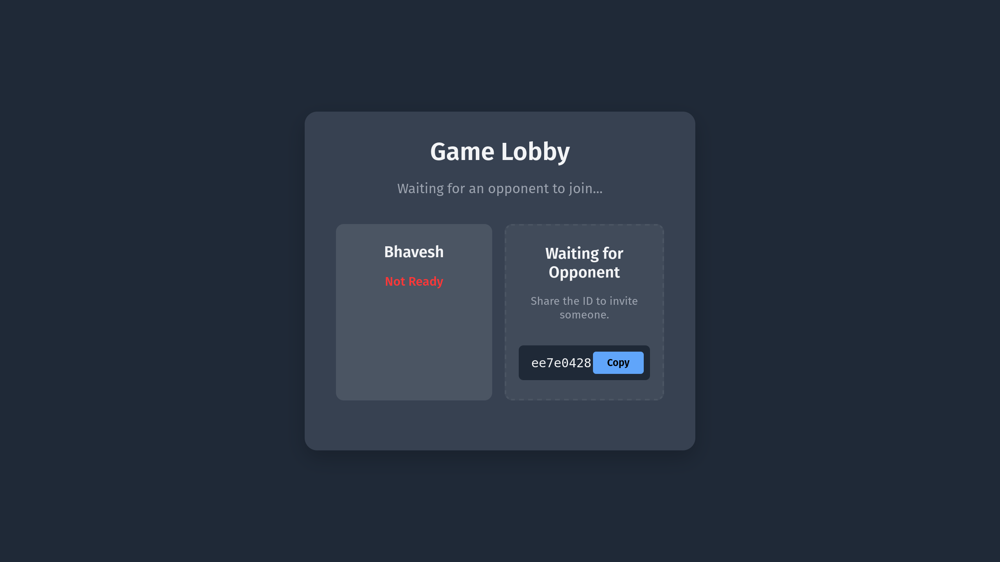
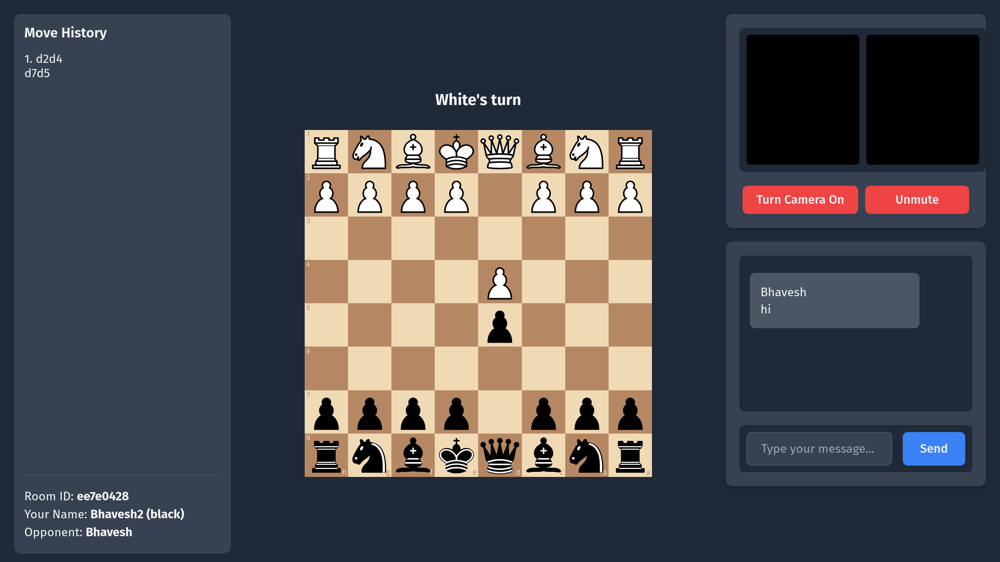

# King's Gambit ♟️

[](https://opensource.org/licenses/MIT)

King's Gambit is a full-stack web application that allows two users to play chess against each other in real-time. The platform features room-based matches and includes integrated video and audio calling to connect with your opponent.

The project is built with a focus on a clean, decoupled architecture and utilizes a modern technology stack including React, Django, WebSockets, and WebRTC, all containerized with Docker for easy setup and deployment.

---
### Video Demo 

https://youtu.be/BYTizdoNZ0M

### Features

* **User Authentication**: Secure user registration and login system.
* **Room-Based Gameplay**: Create a private game room and share the ID to invite an opponent. 
* **Lobby System**: A waiting area where both players can signal they are ready to start. 
* **Real-time Chess**: Gameplay is synchronized instantly between players using Django Channels (WebSockets).
* **Live Video & Audio Chat**: Communicate with your opponent face-to-face using WebRTC (PeerJS).
* **Move History**: Keep track of all moves made throughout the game.

### Screenshots









### Tech Stack & Architecture

The project is architected as a full-stack monorepo with three main services orchestrated by Docker.

* **Frontend**:
    * **Framework**: React 19 (with Vite)
    * **Routing**: React Router
    * **State Management**: React Context API
    * **Real-time**: Native WebSocket API, PeerJS for WebRTC
    * **Libraries**: `axios`, `chess.js`, `react-chessboard`

* **Backend**:
    * **Framework**: Django
    * **Real-time**: Django Channels for WebSocket support
    * **Server**: Daphne ASGI server
    * **Security**: CSRF Protection, Rate Limiting

* **Database & Cache**:
    * **Database**: PostgreSQL
    * **Message Broker**: Redis (for Django Channels layer)

* **DevOps**:
    * **Containerization**: Docker & Docker Compose

### Getting Started

To get a local copy up and running, follow these simple steps.

#### Prerequisites

* Docker and Docker Compose must be installed on your machine.

#### Installation & Setup

1.  **Clone the repository**
    ```sh
    git clone https://github.com/BhaveshKukreja29/KingsGambit
    cd kingsgambit
    ```

2.  **Create an environment file**
    Create a `.env` file in the root directory. This will hold all the environment variables for the Docker containers. Copy the contents of `.env.example` into it, and replace the placeholder values.

    An example `.env` file looks like this:

    ```env
    # .env

    POSTGRES_DB=kingsgambit
    POSTGRES_USER=admin
    POSTGRES_PASSWORD=your_db_password

    DATABASE_NAME=kingsgambit
    DATABASE_USER=admin
    DATABASE_PASSWORD=your_db_password
    DATABASE_HOST=db
    DATABASE_PORT=5432
    DJANGO_SECRET_KEY=your_secret_key

    REDIS_HOST=redis
    REDIS_PORT=6379
    ```

3.  **Build and Run with Docker Compose**
    From the root directory, run the following command. This will build the images and start all the services (`backend`, `db`, `redis`, `peerserver`).

    ```sh
    docker compose up --build
    ```

4.  **Access the Application**
    * The **React Frontend** will be running at `http://localhost:5173`.
    * The **Django Backend** API is accessible at `http://localhost:8000`.
    * The **PeerJS Server** for video chat is at `http://localhost:9000`.

5.  **Running Tests**
    To run the backend test suite, execute the following command in a separate terminal:
    ```sh
    docker compose exec backend pytest
    ```

### Acknowledgements 🙏

This project was made possible by the incredible work of the open-source community. A special thank you to the developers and maintainers of the following libraries and frameworks:

* **[React](https://react.dev/)**: For providing the foundational library for building our user interface.
* **[Django](https://www.djangoproject.com/)**: For the robust and scalable backend framework that powers our application logic.
* **[PeerJS](https://peerjs.com/)**: For simplifying the complexities of WebRTC and making peer-to-peer video chat achievable.
* **[Chess.js](https://github.com/jhlywa/chess.js)**: For the brilliant chess logic and validation library that handles the rules of the game.
* **[Vite](https://vitejs.dev/)**: For the next-generation frontend tooling that provides a lightning-fast development experience.
* **[react-chessboard](https://github.com/Clariity/react-chessboard)**: For the excellent and highly customizable component that renders the interactive chessboard.
* And many others, including **Django Channels**, **PostgreSQL**, **Redis**, and **Docker**.

### License

This project is distributed under the MIT License. See `LICENSE` for more information.